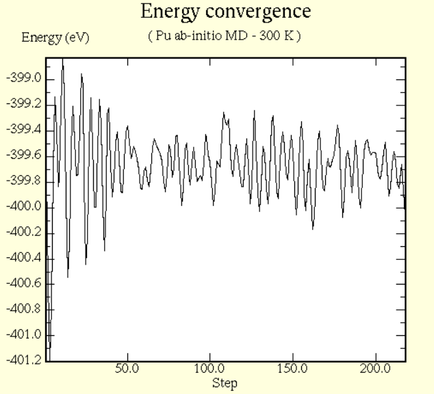

# Ab initio MD simulations of a polyurethane segment

The VASP input files required to conduct ab initio MD simulation of a polyurethane segment (shown below) are provided. A movie of the simulation is [available here](https://youtu.be/Vsq_4CRPE2w).

Energy convergence is shown below (plotted using [p4vasp](http://www.p4vasp.at/#/home)).

A good tutorial on the topic is [available here](https://wiki.bnl.gov/CFN-Computation/images/3/3f/Tutorial6.pdf).

[This example](https://www.vasp.at/wiki/index.php/H2O_molecular_dynamics), available on vasp wiki, is also useful.
